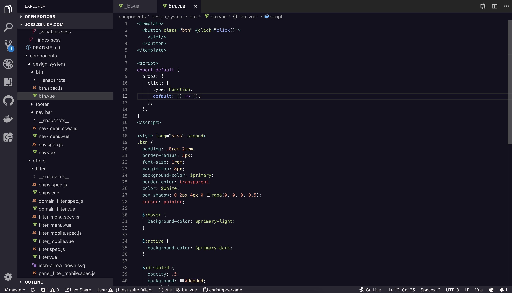

# Lilac VS Code theme 🌸

A purply Visual Studio Code theme.

This theme was made possible thanks to Sarah Drasner's article: https://css-tricks.com/creating-a-vs-code-theme/.

# Installation

1.  Install [Visual Studio Code](https://code.visualstudio.com/)
2.  Launch Visual Studio Code
3.  Choose **Extensions** from menu
4.  Search for `lilac-theme`
5.  Click **Install** to install it
6.  Click **Reload** to reload the Code
7.  From the menu bar click: Code > Preferences > Color Theme > **Lilac Theme**